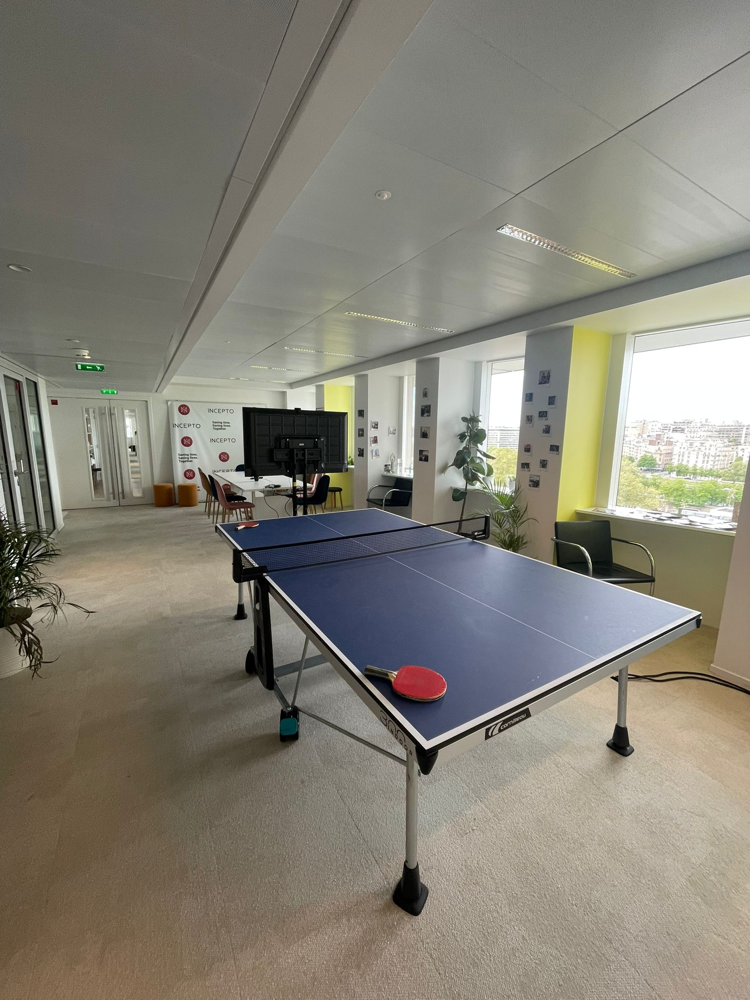
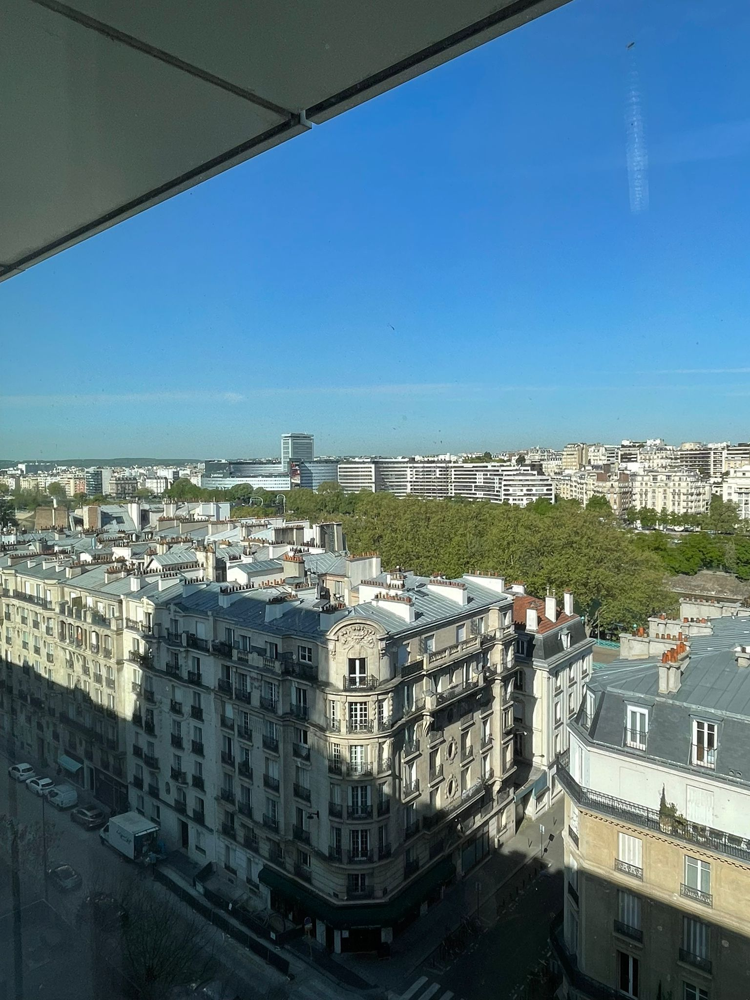

## Introduction

On dit souvent : _l’étonnement est un bonheur_. Je m’appelle Chems, je suis nouveau stagiaire dans l’équipe Data Science, et voici mon rapport d’étonnement, dans lequel je partage mes premières impressions, mes surprises et mes objectifs.

Le 14 avril 2025, j’ai commencé mon stage d’ingénieur. J’arrive à 9h15 : Julia, ma buddy, m’accueille et me prépare un excellent petit-déjeuner – croissant et café – avec toute l’équipe présente. Les premiers échanges sont sympas, légers et accueillants.

---

### **1. Le choix d’Incepto et les idées que j’avais en tête**

Avant d’arriver, je m’imaginais travailler dans un cadre très formel, entouré de personnes très sérieuses, de chercheurs plongés dans leurs recherches… mais ce que j’ai découvert était tout l’inverse.

Chez **Incepto**, j’ai trouvé une ambiance conviviale, une entreprise jeune, avec beaucoup de jeunes dans toutes les équipes. C’est vrai que ce stage m’attirait au départ pour son côté scientifique, son impact et son lien direct avec ma formation. Mais dans la réalité, il n’y a pas **que** la recherche en intelligence artificielle : il y a aussi la compréhension du métier, la vision de l’entreprise et bien d’autres dimensions.

La première semaine a été très intense : répondre à toutes ces questions, comprendre les projets, découvrir l’organisation… ce sont de longues journées remplies de réunions ! Ça a été une semaine extrêmement formatrice, et l’onboarding s’est très bien passé.

La première semaine est vraiment marquante : c’est là que se construisent toutes les premières impressions. Le choix de son endroit préféré pour travailler, les premières interactions avec toute l’équipe… Bref, tout s’est bien passé : j’ai pu découvrir l’environnement, rencontrer les différents membres de l’équipe et commencer à comprendre les enjeux des projets.

## Pour illustrer cette première semaine, voici une photo de mon setup

### 🧩 **2. La réalité : l’endroit, les personnes, l’ambiance**

La réalité, c’est que mon équipe est super sympa. Ils ont été accueillants et chaleureux, et c’est le plus important, selon moi, dans une première prise de contact.

Chaque fois que je bloque, je me tourne vers Walid, Martin ou Benoît, et j’obtiens une aide instantanée. Ce côté proximité entre les employés, je le trouve très efficace pour résoudre les problèmes.

J’ai aussi eu la chance d’échanger avec le CEO à deux reprises. La première fois, c’était lors d’un déjeuner d’équipe, où j’ai appris plein d’informations sur son travail d’expansion aux États-Unis ; la deuxième, lors d’un échange plus détaillé la semaine dernière.  
J’ai senti que les valeurs sont bien véhiculées et partagées par tous les employés, comme le partage et l’humilité.

---

### 🎯 **3. Mes objectifs**

Mes objectifs dans ce stage sont avant tout d’apprendre : c’est mon but principal. Apprendre à coder, à améliorer des modèles de machine learning… mais pas seulement. Je souhaite progresser dans tous les aspects du travail : pour moi, être un bon ingénieur signifie développer mon sens de la communication, mes capacités d’analyse et de synthèse, en particulier dans mes échanges avec mes collègues. Je souhaite aussi grandir sur le plan personnel.

Un stage est, selon moi, l’une des meilleures expériences : on s’engage à apprendre, et les personnes autour de nous s’engagent à nous accompagner et à nous former.

D’un point de vue technique, j’aimerais terminer mon stage en apportant ma “petite brique” au projet sur lequel je travaille, **PAROS**. Je souhaite voir l’impact concret de mon travail.

Je voudrais également tisser de nouveaux liens d’amitié au sein de mon équipe. Avoir un bon environnement de travail est, à mon sens, essentiel pour s’épanouir en entreprise. Je me suis inscrit au même club de boxe que Pascal et je prévois d’aller faire un peu de musculation avec Hamza.

J’ai trouvé que ces trois premières semaines ont été des semaines de découverte, d’échanges et de construction d’une bonne base, qui, je l’espère, me servira tout au long du stage.

---

## Conclusion

En conclusion, j’aimerais revenir sur une citation que mon père m’a transmise lorsque j’avais 13 ou 14 ans :  
**“Choisissez un travail que vous aimez et vous n’aurez jamais à travailler un seul jour de votre vie.”**

Je n’en suis qu’au début, mais j’aime déjà ce que je fais.

Suis-je étonné ? Oui, d’une certaine manière… **agréablement étonné** !

Paris View from office
